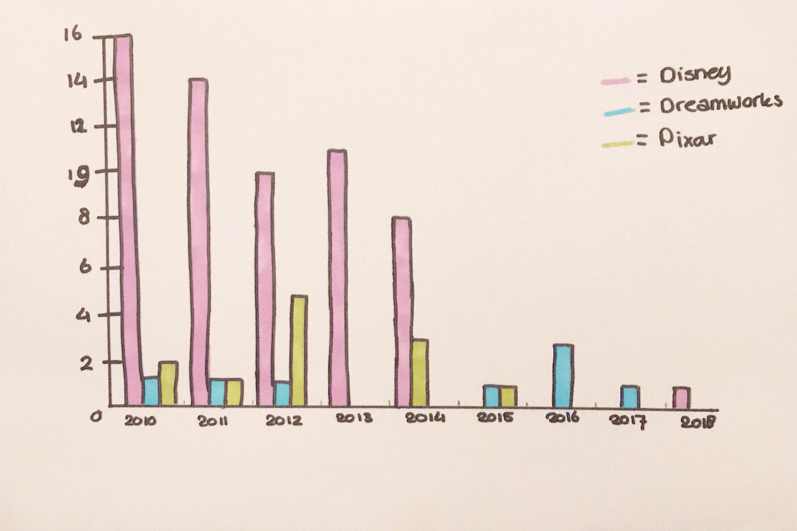

# Functional Programming


* [Assignment](#assignment)
* [Research](#research)
* [Data visualization](#data-visualization)
* [Sketches](#sketches)
* [What is Functional Programmming?](#what-is-functional-programming)
* [Opinion & Experiences](#opinion-&-experiences)
* [What I want to do next](#what-i-want-to-do-next)
* [How to install](#how-to-install)
* [Credits & Help](#credits-&-help)
* [Resources](#resources)

## Assignment

Make a data visualization based on the research you have done with the API from the OBA.

## Research

### Orient

We've got an API from the OBA and with help of the oba-api of [Rijk van Zanten](https://github.com/rijkvanzanten/node-oba-api) we could take a look at the data in the API.
I found interesting data to do my research about: Disney, Pixar and Dreamworks.
After that [Dennis](#credits) and [Folkert-Jan](#credits) made another API that was easy to use and with that API we could also parse the data to JSON, just like with the API of Rijk van Zanten.

Eventually I am using the API of Rijk van Zanten again, but with the help of [Wouter](#credits) and his code I can get more than 20 results.

__*Research questions*__
1. Which genre has become more popular after the year 2000?
2. Has the amount of e-books decreased or increased throughout the years?
3. How many Pixar items are there and how many Disney items?
4. Has the amount of books with black & white illustrations decreased or increased throughout the years?
5. __What is the difference in the amount of films & books Disney, Pixar & Dreamworks brought out starting from the year 2000?__

__*Sub-questions*__
 * Did they release more or less movies in the last five years?
 * Are there more women or men who write the movies?
 * How is the ratio between male and female writers different from the earlier years?

__*Variables*__
  * Publishers;
  * Publication year;
  * Titles of the movies;
  * Number of movies;

This is the data that I need to make a visualization.

#### __*Hypothesis*__  
  Throughout the years there are less movies in the system of the OBA from Disney, Pixar and Dreamworks, but there are still more Disney movies in the systems.

__*Decision*__  
I chose to do my research about Disney, Pixar and Dreamworks movie, because I loved them as a child and still watch them when I feel like it.  
With my research I want to see how many Disney, Pixar and Dreamworks movies the OBA has in their system throughout the years.  
Maybe there is a obvious pattern and maybe not.

## Data visualization
 https://lindadehaan.github.io/functional-programming/barchart5.html

 

### Grouped bar chart
I chose to use a grouped bar chart, because with this kind of chart you can really see the difference between the amount of movies in the system of the OBA.
And you can really see the data for each year you want to show. Not like with a line chart when you show data of january 2010, but than the line gives you an expectation of the result in july 2010. Even when you did not fill in that data, so it can be totally off.

## Sketches

  




## What is Functional Programming?

What is functional programming: Functional programming (often abbreviated FP) is the process of building software by composing pure functions, avoiding shared state, mutable data, and side-effects. Functional programming is declarative rather than imperative, and application state flows through pure functions. Contrast with object oriented programming, where application state is usually shared and colocated with methods in objects.([source: Median](https://medium.com/javascript-scene/master-the-javascript-interview-what-is-functional-programming-7f218c68b3a0))

## Opinion & Experiences
Through this course I learned a lot, but overall I learned that the pace in the class is very high and sometimes hard to follow.

When you can't make sense of the data you have in front of you, it is very hard to come up with questions about the data that you see. Luckily there were some other students and we figured it out together.

It was nice that we had a big group of people who were working on the same thing. In this way you can work together with everybody and help everybody. I found that other students did not find it annoying to help students. When I saw that it was easier to ask for help myself.
The respository of [Daniel van de Velde](#credits) was very helpful, he had a whole list of everything you could filter on on his repository. He even showed how everything was nested. I used this list and his repository a lot to filter de data.

Because other students helped me, I understand how I can get data from the API from the OBA. I would've never figured this out on my own. At the beginning we got the OBA API, but to me it felt like we had to figure it all out on our own. There were so many students who had never worked with an API in this way and we just had to figure it all out ourselves. Luckily there were students who did understand it and probably worked with an API in this way before.

You can structure the data in `JSON` and properly see what kind of data you have. After you filter it though, because otherwise you get a lot of result back.

How the data looks in the terminal and `json`:
```json
[
  { "title": "The Pixar story / een documentaire van Leslie Iwerks",
    "author": "Leslie Iwerks",
    "publicationYear": "2012",
    "publisher": "Buena Vista Home Entertainment" },
  { "title": "5 Pixar movie collection Vol. 2",
    "author": "John Lasseter",
    "publicationYear": "2012",
    "publisher": "Buena Vista Home Entertainment" },
  { "title": "Pixar short films collection Vol. 2",
    "author": "undefined",
    "publicationYear": "2012",
    "publisher": "Buena Vista Home Entertainment" },
  { "title": "5 Pixar movie collection Vol. 3",
    "author": "John Lasseter",
    "publicationYear": "2012",
    "publisher": "Buena Vista Home Entertainment" },
  { "title": "Pixar shorts : mini collection",
    "author": "undefined",
    "publicationYear": "2012",
    "publisher": "Buena Vista Home Entertainment" },
  { "title": "Inside out / codirected by Ronaldo Del Carmen",
    "author": "Pete Docter",
    "publicationYear": "2015",
    "publisher": "Disney DVD" },
  { "title": "Toy story 3 / directed by Lee Unkrich",
    "author": "Lee Unkrich",
    "publicationYear": "2010",
    "publisher": "Buena Vista Home Entertainment" },
  { "title": "Toy story / cast Tom Hanks, Tim Allen",
    "author": "John Lasseter",
    "publicationYear": "2010",
    "publisher": "Buena Vista Home Entertainment" },
  { "title": "Toy story 2 / [voices] Tom Hanks, Tim Allen",
    "author": "John Lasseter",
    "publicationYear": "2011",
    "publisher": "Buena Vista Home Entertainment" } ]
```

I became very enthusiastic about Observable because Bert Spaan came to tell about it. How you can change something while you are reading it and it actually changes immediately.  
I tried to use Observable, but it was very hard to understand how it exactly works. So I want to try and use it in the upcoming weeks, because I really want to understand it.

I've learned a lot about D3.js. When Titus gave the workshop about D3 I thought I would understand it pretty well. Eventually I do understand D3, but it was harder than I thought.  
I think it is amazing to see that you can make very amazing visualizations with a lot of math. That was the most interesting part of D3 to me, it is a lot of math and I like math a lot.
I also learned how you can rewrite version 3 of D3 to version 5. Because I rewrote some of the code, I understood it better. I had to read about why some parts changed in newer versions, so that is why I understand I had to change some parts.

Mark from the OBA already saw my data visualization and could immediately get a conclusion out of it. There could be several reasons that there are less movies in the systems of Disney, Pixar and Dreamworks over the years.
- Maybe there is less interest in DVDs;
- Maybe is has something to do with the right to buy the movies;
- Or maybe it is another reason.

Mark said that he could go to the right department to know why the visualizations looks like this.

## What I want to do next
I still want my data to load dynamic. Now I do this with a `json` file.  And I still want to make sure I can put everything in Observable, because I really want to understand how that works.

I want users to see the name of the movie when the OBA only had one movie in a certain year. I am going to do this with a tooltip.

__*How can I go further with my research?*__  
I can compare how many movies every company brought out and how many movies there are in the OBA system.

Maybe I want to look at how many males and females wrote movies for Disney, Pixar and Dreamworks, but I have to figure out if that is relevant for my research.

## How to install
You need to change directory in your terminal first to the folder where you want to install everything. Use cd in your terminal to get to the place where you want to install on you computer.
Example: cd folder_name

To clone the repository:
```
git clone https://github.com/LindadeHaan/functional-programming
cd functional-programming
npm install
```

Start server:
```
node index.js
```

### package.json
To make a package.json file you have to follow a few steps in your terminal:
```
npm init
```
After `npm init` you just have to fill in what your terminal requires.
In your package.json file you can see which packages you already installed and which packages you still have to install.

### packages

* [node-oba-api-wrapper](https://github.com/maanlamp/node-oba-api-wrapper)
* [oba-api](https://github.com/rijkvanzanten/node-oba-api)
* [dotenv](https://github.com/motdotla/dotenv)

## Process

To see my process click [here](https://github.com/LindadeHaan/functional-programming/blob/master/logboek.md).

## Credits & Help
* [Jessie Mason](https://github.com/jessiemasonx/functional-programming)
* [Dennis Wegereef](https://github.com/Denniswegereef/functional-programming)  
* [Folkert-Jan van der Pol](https://github.com/FJvdPol/functional-programming)  
* [Chelsea Doeleman](https://github.com/chelseadoeleman/functional-programming)  
* [Daniël van de Velde](https://github.com/DanielvandeVelde/functional-programming)  
* [Maikel van Veen](https://github.com/Maikxx/functional-programming)  
* [Wouter Lem](https://github.com/maanlamp/functional-programming)  

## Resources

* [Stackoverflow](https://stackoverflow.com/)
* MDN
* [Medium Freecodecamp](https://medium.freecodecamp.org/)
* [Grouped Bar Chart](https://bl.ocks.org/bricedev/0d95074b6d83a77dc3ad)
* [Github](https://github.com/)
